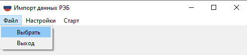
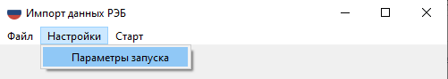
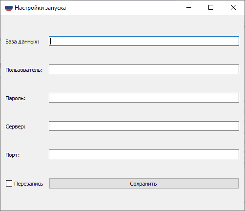
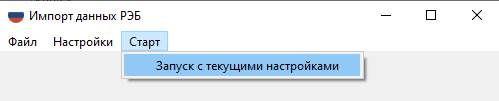

# Визуализатор

## Сборка программного средства

```console
$ pip3 install --user -r requirements.txt
```

Содержание файла `requirements.txt`:

```
openpyxl==3.1.2
psycopg2==2.9.5
loguru==0.6.0
PyQt5==5.15.9
auto-py-to-exe==2.35.0
```

При возникновении ошибки установки 'psycopg2' использовать 'psycopg2-binary'

## База данных

### Загрузка образа Postrges

```console
$ docker pull postgres:15.2
```

### Нюансы работы в ОС Windows

Для работы в ОС Windows необходима установка Docker Engine с [официального сайта](https://docs.docker.com/desktop/install/windows-install/).

Для работы Docker в Windows так же необходима установка подсистемы Linux:

```console
$ wsl --install
```

В случае необходимости, установить [пакет обновления ядра Linux в WSL 2 для 64-разрядных компьютеров](https://wslstorestorage.blob.core.windows.net/wslblob/wsl_update_x64.msi).


### Запуск контейнера с некоторым набором параметров

```console
$ docker run --name test-postgres -p 5432:5432 -e POSTGRES_USER=postgres -e POSTGRES_PASSWORD=postgres -e POSTGRES_DB=postgres -d postgres:15.2
```

## Графический интерфейс

### Запуск графического интерфейса через терминал (необходимо находиться в корневой директории ПС)

```console
$ python -m app
```

### Порядок работы с графическим интерфейсом

1. Для загрузки файла в БД необходимо выбрать исходный .xlsx файл(Файл => Выбрать)

    

1. После выбора файла необходимо задать параметры подключения к бд (Настройки => Параметры запуска)

    
    

    Пример параметров:
    ```
        База данных: "postgres"
        Пользователь: "postgres"
        Пароль: "postgres"
        Хост: "127.0.0.1"
        Порт: "5432"
        Перезапись: false
    ```
1. После выбора файла и ввода параметров запуск программы (Старт => Запуск с текущими настройками)

    

### Сборка приложения в исполняемый файл

Для сборки ПС необходима python-библиотека `auto-py-to-exe` версии `2.35.0` (указана в `requrements.txt`)

1. Запускаем auto-py-to-exe через терминал:
    ```console
    auto-py-to-exe
    ```

1. Заполняем необходимые поля. В примере ниже редактируются:
    
    * Onefile - данные ПС будут храниться в одном файле;

    * Console Window - скрыть или отобразить терминал при запуске

    * Icon - выбор иконки приложения

    * Settings/Output Directory - место, где будет расположен собранный исполняемый файл

    

    и нажимаем **CONVERT .PY TO .EXE**. Собранный файл будет находиться в указанной директории

## Запуск ПС в терминале

В случае необходимости, предусмотрена возможность запуска ПС напрямую из терминала:

```console
$ python3 -m main <params> 
```

### Параметры запуска:

    '-f' или '--filename' - путь до входного .xlsx файла (обязательный параметр)
    '-d' или '--database' - название БД
    '-u' или '--user' - имя пользователя
    '-ps' или '--password' - пароль
    '-ht' или '--host' - сервер postgres
    '-p' или '--port' - порт
    '-o' или '--overwrite' - флаг, позволяющий перезаписывать значения в бд вместо добавления

По умолчанию каждый параметр (кроме filename) принимает значение из конфигурационного json-файла

## Конфигурационный файл

При запуске программного средства без параметров параметры подключения к Postgres будут считываться из конфигурационного json-файла **./config/config-json**. В случае отсутствия директории **config** или файла **config.json**, необходимо их создать вручную.

Пример оформления **config.json** представлен ниже:

```json
{
    "database": "postgres",
    "user":     "postgres",
    "password": "postgres",
    "host":     "127.0.0.1",
    "port":     "5432",
    "overwrite": false,
    "log_file": "logs.log"
}
```
